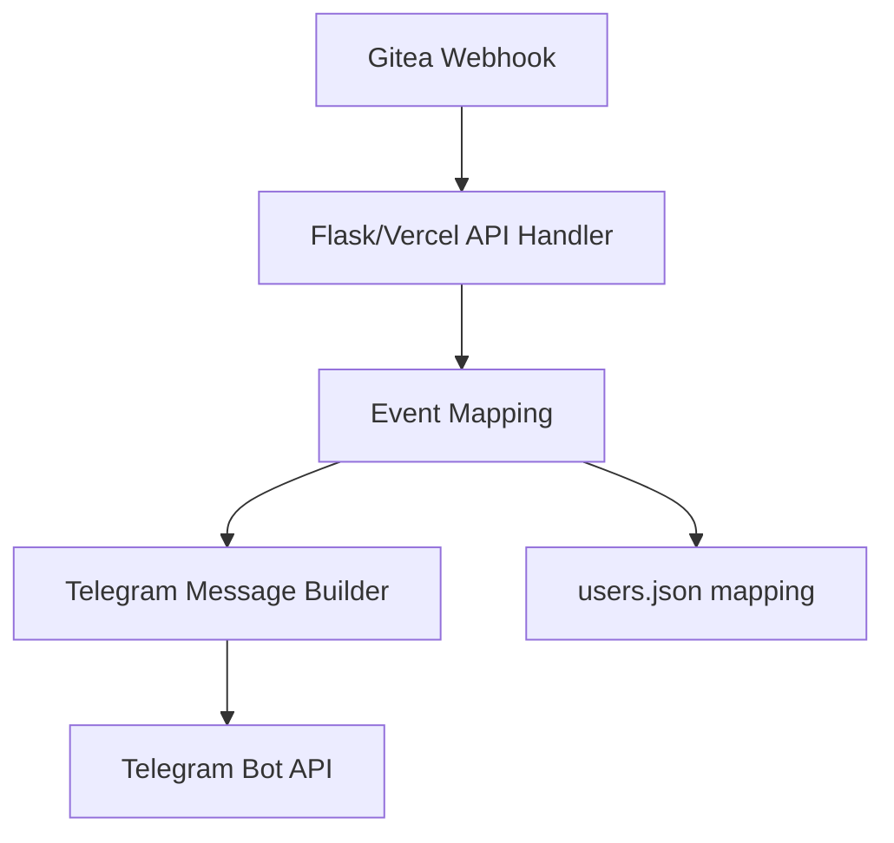
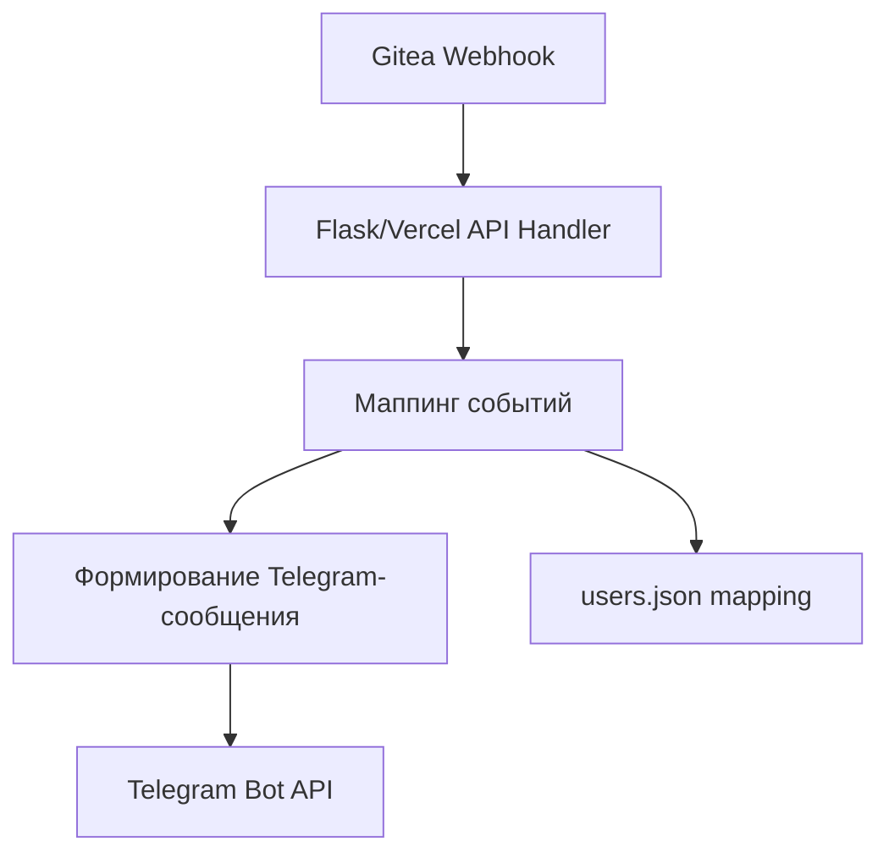

# Telegram Webhook Bot for Gitea Integration

## English

## Problem
Development teams miss important Gitea activity when PR/issue notifications are not centralized in Telegram.

## Solution
This project runs a webhook receiver that processes Gitea events and forwards formatted notifications to Telegram chats/threads.

## Tech Stack
- Python 3.9+
- Flask
- python-telegram-bot
- python-dotenv
- Vercel deployment config (`vercel.json`)

## Architecture
Top-level structure:
```text
TelegramWebhookBot.py
api/
requirements.txt
users.json
vercel.json
```



## Features
- Receives Gitea webhook payloads
- Sends Telegram notifications for repository events
- Supports user mapping for personalized notifications
- Ready for Vercel-style deployment

## How to Run
```bash
python -m venv .venv
source .venv/bin/activate
pip install -r requirements.txt
cp .env.example .env
python TelegramWebhookBot.py
```

For Vercel deployment, keep `vercel.json` and `api/` routes configured and set env vars in Vercel.

## Русский

## Проблема
Команды разработки теряют важные события из Gitea, когда уведомления о PR/issue не централизованы в Telegram.

## Решение
Проект поднимает webhook-обработчик, который принимает события Gitea и отправляет форматированные уведомления в Telegram-чат/тему.

## Стек
- Python 3.9+
- Flask
- python-telegram-bot
- python-dotenv
- Конфиг деплоя Vercel (`vercel.json`)

## Архитектура
Верхнеуровневая структура:
```text
TelegramWebhookBot.py
api/
requirements.txt
users.json
vercel.json
```



## Возможности
- Прием payload’ов Gitea webhook
- Отправка уведомлений Telegram по событиям репозитория
- Сопоставление пользователей для персонализации
- Готовность к деплою на Vercel

## Как запустить
```bash
python -m venv .venv
source .venv/bin/activate
pip install -r requirements.txt
cp .env.example .env
python TelegramWebhookBot.py
```

Для деплоя на Vercel используйте `vercel.json`, `api/` и задайте env vars в настройках проекта.
